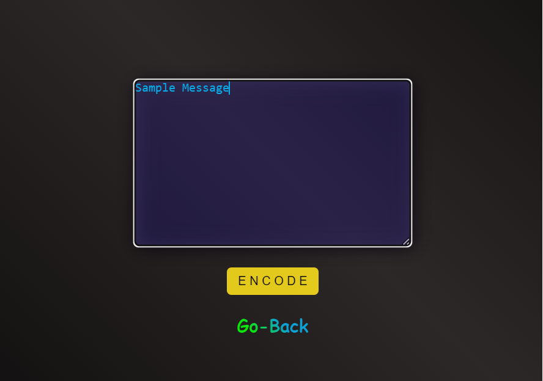
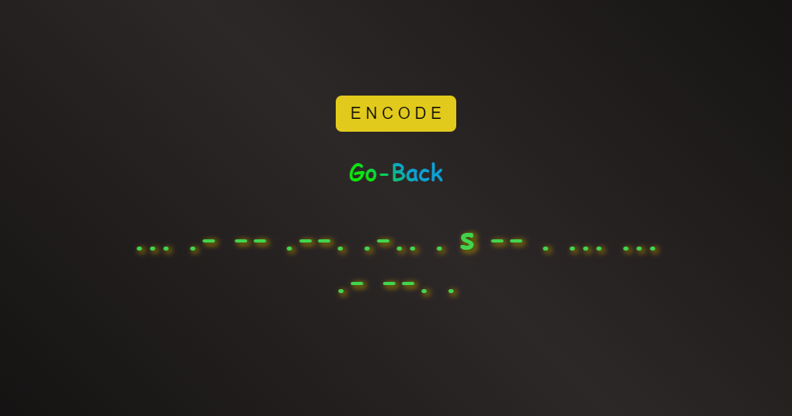
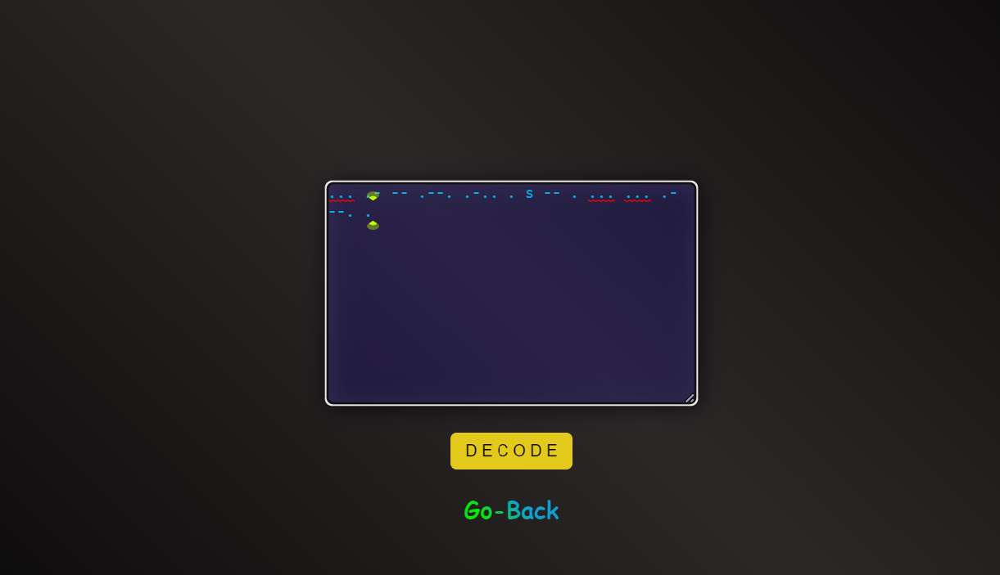

 # _⭕  Morse-Code-Translator ⭕_
 

## <b>**_Short Info :_**<b>
- `This is Simple Project on Javascript to Understand the Basic of it`**.**
<!-- ## **_Preview :_** -->

<h2 style="text-align:center;font-style:italic;font-size:2em"><i>Preview Images :</i></h2>

# _Encode :_

  - 
 
- 
  
- 

  
# _Decode :_

- 

- 

# - - - - - - - - - - - - - - - - - - - - - - - - - - - - - - - - - - - - -  

